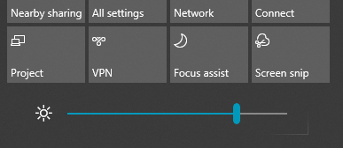

# Ändern der Bildschirmhelligkeit in Windows 10

Wenn Ihr Windows 10 neuer als Version 1903 ist, verfügt es über einen **Helligkeitsschieberegler** im Info-Center. Zum Öffnen des Info-Centers klicken Sie auf der rechten Seite der Taskleiste auf die Schaltfläche **Benachrichtigung** oder drücken Sie auf der Tastatur **Windows Home + A**.

Wenn Ihr Windows 10 eine frühere Version ist, finden Sie den Helligkeitsregler unter **[Einstellungen > System > Anzeige](ms-settings:display?activationSource=GetHelp)**.

**Hinweise**:

- Möglicherweise wird der Regler "Helligkeit ändern" für integrierte Anzeigen auf Desktop-PCs mit einem externen Monitor nicht angezeigt. Wenn Sie die Helligkeit eines externen Monitors ändern möchten, verwenden Sie die Steuerelemente auf dem Bildschirm.
- Wenn Sie keinen Desktop-PC besitzen und der Schieberegler nicht angezeigt wird oder funktioniert, versuchen Sie, den Bildschirmtreiber zu aktualisieren. Geben Sie **Geräte-Manager** in das Suchfeld in der Taskleiste ein und wählen Sie dann **Geräte-Manager** aus der Ergebnisliste aus. Wählen Sie in **Geräte-Manager** **Grafikkarte** aus und wählen Sie dann die Option „Grafikkarte“ aus. Drücken und halten Sie den Namen der Grafikkarte gedrückt (oder klicken Sie mit der rechten Maustaste) und klicken Sie auf **Treiber aktualisieren**; folgen Sie dann den Anweisungen.
