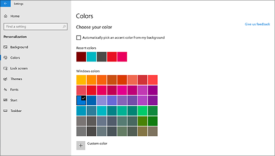
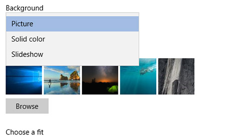

# Ändern des Desktophintergrunds und der Farben

Wechseln Sie zum Ändern der Farbeinstellung zu **"Start**  >  **Einstellungen**  >  **Personalization**  >  **Colors",** und wählen Sie dann Ihre eigene Farbe aus, oder lassen Sie Windows eine Akzentfarbe aus dem Hintergrund ziehen.

Wechseln Sie zum Ändern des Desktophintergrunds zu  >  **"Start Einstellungen**  >  **Personalization**  >  **Background",** und wählen Sie dann ein Bild, eine Volltonfarbe oder eine Bildschirmpräsentation mit Bildern aus. 

Möchten Sie mehr Desktophintergründe und -farben? Besuchen Sie [Microsoft Store,](https://www.microsoft.com/store/collections/windowsthemes) um aus Dutzenden kostenloser Designs auszuwählen.
