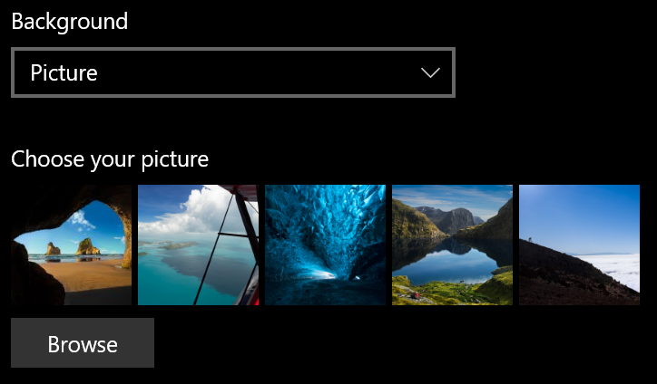
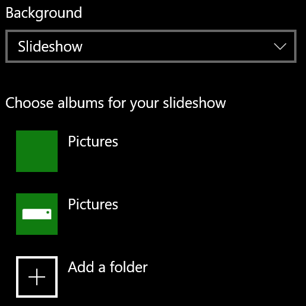

# Ändern des Hintergrunds des Sperrbildschirms

- Wechseln Sie zum **Bildschirm Einstellungen** >  **PersonalizationLock** >. **** Oder klicken oder tippen Sie [hier](ms-settings:lockscreen?activationSource=GetHelp).

- Wenn Sie ein benutzerdefiniertes Hintergrundbild festlegen möchten, wählen Sie **"Bild** " aus der Dropdownliste " **Hintergrund** " aus, und wählen Sie das Bild aus, oder **navigieren Sie** zu dem Bild.

  

- Um eine Bildschirmpräsentation mit benutzerdefinierten Bildern einzurichten, wählen Sie **in** der **Dropdownliste "Hintergrund** " die Bildschirmpräsentation aus, und wählen Sie ein Album aus, oder fügen Sie einen Ordner hinzu, der die Bilder für die Bildschirmpräsentation enthält.

  
