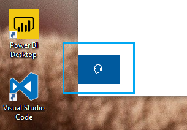

# Kontaktieren Sie uns, indem Sie auf die Kopfhörertaste klicken.

Wenn Sie sich an den Microsoft-Support wenden möchten, klicken Sie in der unteren linken Ecke dieser App auf **"Kontaktieren** ". Im Fly-Out-Fenster werden Sie nach der Auswahl Ihres Produkts und der Problemkategorie zum richtigen Supportkanal geführt.

Sie können weiterhin mit dem Rest der App interagieren, auch nachdem Sie eine Kontaktsitzung initiiert haben. Der Bereich "Kontakt kontaktieren" kann vorübergehend minimiert werden, indem an einer anderen Stelle in der App geklickt wird. Um zur gleichen Sitzung zurückzukehren, klicken Sie einfach erneut auf **"Kontaktieren"** .
