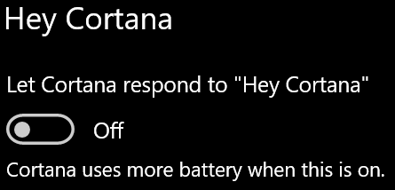

# Cortana spricht nicht mit mir oder kann mich nicht hören

Wenn Sie versuchen, die Funktion „Hallo Cortana“ zu verwenden, die es Ihnen ermöglicht, mit Cortana zu sprechen, ohne den Cortana-Button in der Taskleiste oder den Mikrofon-Button im Bedienfeld von Cortana auszuwählen, bestätigen Sie, dass die Funktion aktiviert ist:

1. Wechseln Sie zu **Startseite** und wählen Sie dann **[Einstellungen > Cortana](ms-settings:cortana?activationSource=GetHelp)** aus.
2. Unter **Hallo Cortana** schalten Sie den Schalter **Cortana auf „Hallo Cortana“ reagieren lassen** auf **Ein**.

**Verhindern Ihre Datenschutzeinstellungen, dass Cortana Sie hören kann?**

Ihre Datenschutzeinstellungen können verhindern, dass Cortana auf Ihre Stimme reagiert.
- Stellen Sie sicher, dass die Online-Spracherkennung aktiviert ist:
    - Wechseln Sie zu **Startseite** und klicken Sie dann auf **[Einstellungen > Datenschutz > Sprache](ms-settings:privacy-speech?activationSource=GetHelp)**.
    - Schalten Sie unter **Online-Spracherkennung** die Einstellung auf **Ein**.
- Stellen Sie sicher, dass Cortana die Berechtigung hat, auf Ihr Mikrofon zuzugreifen. 
    - Wechseln Sie zu Startseite und klicken Sie dann auf **[Einstellungen > Datenschutz > Mikrofon](ms-settings:privacy-microphone?activationSource=GetHelp)**.
    - Suchen Sie unter **Wählen Sie welche Anwendungen auf Ihr Mikrofon zugreifen können** in der Liste der Anwendungen und Dienste nach **Cortana** und stellen Sie sicher, dass der Schalter auf **Ein** geschaltet ist. 

Bitte vergewissern Sie sich auch, dass Ihre Lautsprecher oder Mikrofone funktionieren, damit Sie mit Cortana sprechen können.
