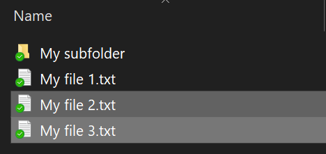
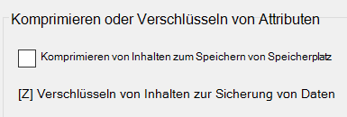

# Verschlüsseln von Dateien oder Ordnern unter Windows 10

Ein gesamtes Laufwerk können Sie mit BitLocker verschlüsseln. Einzelne Dateien oder Ordner (und deren Inhalte) verschlüsseln Sie folgendermaßen:

1. Wählen Sie im **Datei-Explorer** die/den Datei(en)/Ordner aus, die/den Sie verschlüsseln möchten. In diesem Beispiel wurden zwei Dateien ausgewählt:

    

2. Klicken Sie mit der rechten Maustaste auf die ausgewählten Dateien und klicken Sie anschließend auf **Eigenschaften**.

3. Klicken Sie im Dialogfenster **Eigenschaften** auf **Erweitert**.

4. Aktivieren Sie im Dialogfenster **Erweiterte Eigenschaften** das Kontrollkästchen **Inhalte zum Schutz der Daten verschlüsseln**:

    

5. Klicken Sie auf **OK**.
