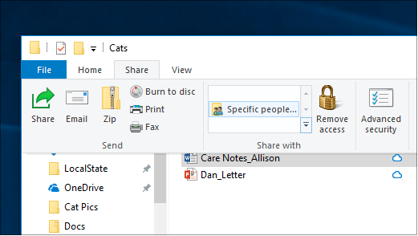
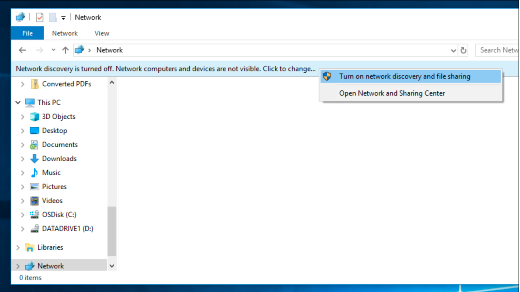

# Dateifreigabe über ein Netzwerk in Windows 10

**Hinweis**: Wenn Sie homeGroup zuvor für die Dateifreigabe verwendet haben, beachten Sie, dass HomeGroup aus Windows 10 (Version 1803) entfernt wurde. Sie können jetzt Drucker und Dateien mithilfe der integrierten Features in Windows 10 freigeben.

**So geben Sie Dateien oder Ordner über ein Netzwerk frei**

- Wählen Sie **in Explorer** eine Datei aus, > klicken Sie oben > im Abschnitt "**Freigeben für**" auf die Registerkarte "**Freigeben**" und dann auf **"Bestimmte Personen**".

    
          
- Wenn Sie mehrere Dateien gleichzeitig auswählen, können Sie sie alle auf die gleiche Weise freigeben. Es funktioniert auch für Ordner.

**So zeigen Sie Geräte im Netzwerk an, die Dateien freigeben**

- Wechseln Sie **in Explorer** zu **"Netzwerk"**. Wenn die Netzwerkermittlung nicht aktiviert ist, wird die Fehlermeldung "Netzwerkermittlung ist deaktiviert..." angezeigt.

- Klicken Sie auf das Banner **"Netzwerkermittlung ist deaktiviert** " und dann auf **"Netzwerkermittlung und Dateifreigabe aktivieren**".

    

[Weitere Informationen zur Dateifreigabe über ein Netzwerk](https://support.microsoft.com/help/4092694/windows-10-file-sharing-over-a-network)

[Freigeben von Dateien mithilfe von Apps, OneDrive, E-Mails und mehr](https://support.microsoft.com/help/4027674/windows-10-share-files-in-file-explorer)
