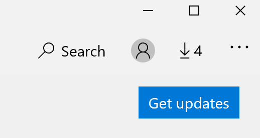

# Korrigieren der Anzeigesprache von Apps

Nachdem Sie die Anzeigesprache in Windows 10 geändert haben, verwenden einige Apps möglicherweise weiterhin die vorherige Sprache, wenn Sie sie öffnen. Dies geschieht, da neue Versionen der Apps für diese Sprache aus dem Store heruntergeladen werden müssen. Um dieses Problem zu beheben, können Sie entweder auf das automatische Update warten oder die aktualisierte Version der Apps manuell installieren.

Um das Update manuell zu installieren, öffnen Sie **Microsoft Store**, und klicken Sie in der oberen rechten Ecke auf **"Downloads und Updates**". Klicken Sie dann auf **"Updates abrufen**". Wenn die Sprache nach Abschluss des Updates nicht geändert wird, versuchen Sie, Ihren PC neu zu starten.

Weitere Informationen zu Eingabe- und Anzeigespracheneinstellungen finden [Sie unter Verwalten der Eingabe- und Anzeigespracheneinstellungen in Windows 10](https://support.microsoft.com/help/4027670/windows-10-add-and-switch-input-and-display-language-preferences).
