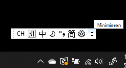
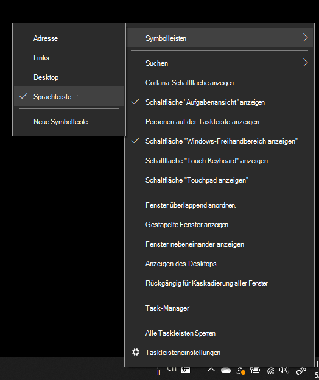
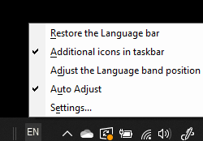

# Ausblenden, Einblenden oder Zurücksetzen der Sprachenleiste

**So minimieren Sie die Sprachenleiste:**

Sie können auf die Schaltfläche „Minimieren“ in der oberen rechten Ecke der Sprachenleiste klicken. Alternativ können Sie die Sprachenleiste auch einfach auf die Taskleiste ziehen, wodurch sie automatisch minimiert wird.

**So docken Sie die Sprachenleiste ab:**

Wenn Sie die Sprachenleiste nicht an die Taskleiste anheften möchten, klicken Sie in der Taskleiste mit der rechten Maustaste auf einen leeren Bereich, und deaktivieren Sie die Option **Sprachenleiste** im Menü „Symbolleisten“. Dadurch wird die Sprachenleiste außerhalb der Taskleiste angezeigt, wie im vorherigen Screenshot.

**So stellen Sie die standardmäßige Sprachenleiste wieder her:**

Klicken Sie mit der rechten Maustaste auf die Schaltfläche „Sprache“ in der Symbolleiste, und klicken Sie dann im Menü auf die Option **Sprachenleiste wiederherstellen**. Dies stellt die Standardeinstellung wird wiederhergestellt.

