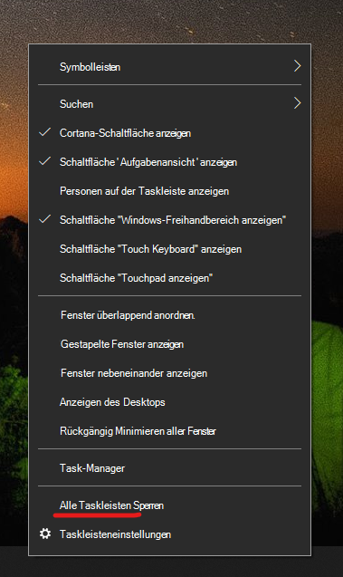

# Verschieben der Taskleiste entweder zur Seite oder an den oberen Rand Ihres Desktops

Stellen Sie zunächst sicher, dass die Taskleiste nicht fixiert ist. Um herauszufinden, ob diese entsperrt ist, klicken Sie mit der rechten Maustaste auf eine beliebige leere Stelle in der Taskleiste und überprüfen Sie, ob die Option **Taskleiste fixieren** ausgewählt ist. Falls ausgewählt, ist die Taskleiste fixiert und kann nicht verschoben werden. Wenn Sie die Option **Taskleiste fixieren** einmal anklicken, wird die Fixierung aufgehoben und das Häkchen entfernt.

Wenn Sie über mehrere Bildschirme verfügen, die die Taskleiste anzeigen, wird die Option **Alle Taskleisten fixieren** angezeigt.

Sobald die Taskleiste nicht mehr fixiert ist, können Sie einen beliebigen leeren Bereich auf der Taskleiste gedrückt halten und an die gewünschte Stelle auf dem Bildschirm ziehen. Sie können dazu auch mit der rechten Maustaste auf eine beliebigen leeren Bereich auf der Taskleiste klicken und **[Taskleisteneinstellungen](ms-settings:taskbar?activationSource=GetHelp) > Position der Taskleiste auf dem Bildschirm** wählen.
