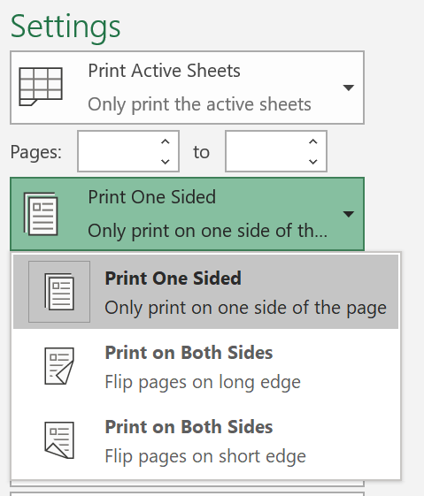
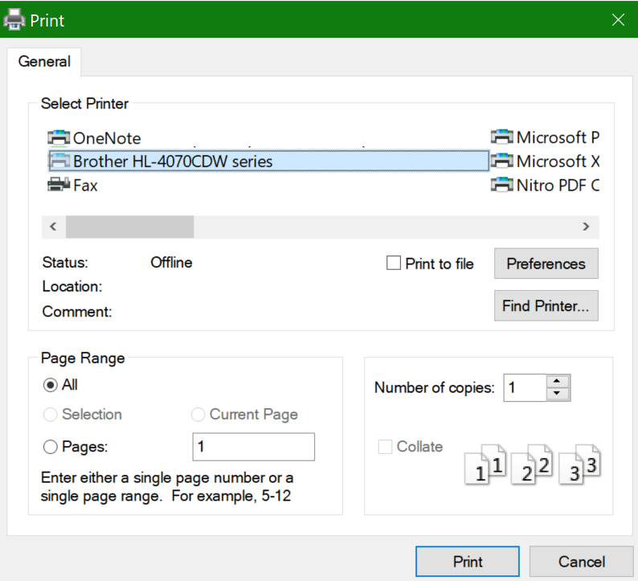

# Beidseitiges Bedrucken von Papier (Duplexdruck)

**Wird Duplexdruck auf meinem Drucker unterstützt?**

In der Funktionsübersicht oder im Handbuch Ihres Druckers sollten Sie nachlesen können, ob er beidseitiges Bedrucken von Papier, auch bekannt als „Duplexdruck“, unterstützt. Wenn Sie über Microsoft Office verfügen, können Sie dies auch herausfinden, indem Sie eine Office-App wie Word oder Excel öffnen, auf **Datei > Drucken** wechseln, sicherstellen, dass der richtige Drucker ausgewählt ist, und im Abschnitt „Einstellungen“ nach der Funktion suchen. Zum Beispiel: 

**Duplexdruck in Microsoft Office**

Wenn Ihr Drucker beidseitiges Bedrucken unterstützt, dann sehen Sie, wenn Sie in der Office-App auf **Datei > Drucken** wechseln, die Option „Beidseitiges Bedrucken“, wie im obigen Beispiel gezeigt.  Wählen Sie die gewünschte Duplexdruckform aus (auf der langen Seite kippen oder auf der kurzen Kante kippen), und klicken Sie auf **Drucken**, um den Ausdruck zu starten.

**Duplexdruck aus einer beliebigen Anwendung**

In vielen Apps sehen Sie beim Drucken ein allgemeines Dialogfeld „Drucken“, das wie folgt aussieht: 

Vergewissern Sie sich, dass der richtige Drucker ausgewählt ist, und klicken Sie dann auf Einstellungen, um das Fenster mit den **Druckereinstellungen** zu öffnen. Wenn der Drucker den Duplexdruck unterstützt, wird die Aktivierung dieser Funktion für den aktuellen Druckauftrag in diesem Fenster angezeigt.
