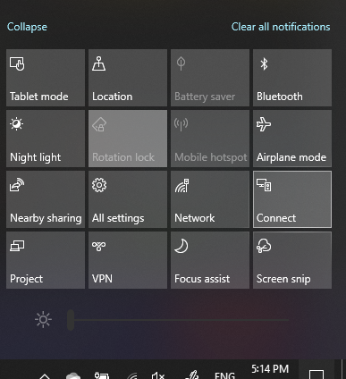

# Auf einen PC projizieren

Suchen Sie auf Ihrem Zielgerät (auf das projiziert werden soll) nach „Projektionseinstellungen“, um die Einstellungsseite von **Auf diesen PC projizieren** zu öffnen. Stellen Sie dann Folgendes sicher:
- Das Dropdownmenü "Einige Windows- und Android-Geräte können auf diesen PC projizieren, wenn Sie zustimmen“ ist auf **Immer aus** festgelegt.
- Das Dropdownmenü „Nachfragen, ob auf diesen PC projiziert werden soll“ ist auf **Jedes Mal, wenn eine Verbindung erforderlich ist** festgelegt.
- Das Dropdownmenü „PIN ist für das Pairing erforderlich“ ist auf **Nie** festgelegt.

Starten Sie auf Ihrem Zielgerät die App **Verbinden**, indem Sie zu **Start** wechseln und nach „Verbinden“ suchen.

Führen Sie dann auf Ihrem Quellgerät, von dem aus Sie projizieren möchten, Folgendes aus:

1. Drücken Sie die **Windows-Taste + A**, um das Info-Center zu öffnen.
2. Klicken Sie auf **Verbinden**.
3. Klicken Sie auf das Gerät, auf das Sie den Bildschirm projizieren möchten.

Nach den vorstehenden Schritten sollte Ihr Zielgerät den Bildschirm des Quellgeräts anzeigen, als ob es sich um einen sekundären Monitor handelt.
