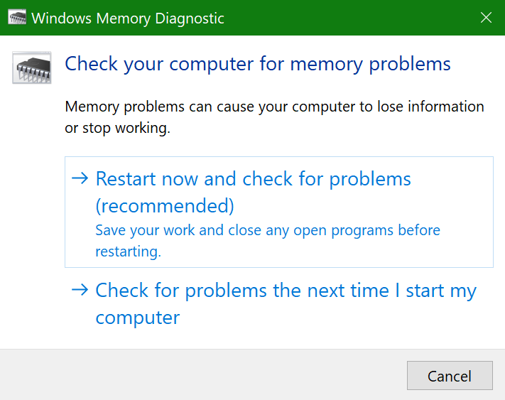

# Ausführen von Windows-Speicherdiagnose in Windows 10

Wenn Windows und Apps auf Ihrem PC abstürzen, einfrieren oder sich instabil verhalten, haben Sie möglicherweise ein Problem mit dem Arbeitsspeicher (RAM) des PCs. Sie können die Windows-Speicherdiagnose ausführen, um nach Problemen mit dem Arbeitsspeicher des PCs zu suchen.

Geben Sie in das Suchfeld in der Taskleiste **Speicherdiagnose** ein, und wählen Sie dann **Windows-Speicherdiagnose**. 

Damit die Diagnose ausgeführt werden kann, muss der PC neu gestartet werden. Sie haben die Möglichkeit, sofort neu zu starten (bitte speichern Sie Ihre Arbeit und schließen Sie zuerst geöffnete Dokumente und E-Mails), oder Sie können die Diagnose so planen, dass sie beim nächsten Neustart des PCs automatisch ausgeführt wird:

Wenn der PC neu gestartet wird, wird das **Windows-Speicherdiagnosetool** automatisch ausgeführt. Status und Fortschritt werden während des Diagnoselaufs angezeigt, und Sie haben die Möglichkeit, die Diagnose durch Drücken der Taste **ESC** auf Ihrer Tastatur abzubrechen.

Nach Abschluss der Diagnose wird Windows normal gestartet. Unmittelbar nach dem Neustart, wenn der Desktop angezeigt wird, erscheint eine Benachrichtigung (neben dem Symbol **Info-Center** in der Taskleiste), um anzuzeigen, ob Speicherfehler gefunden wurden. Beispielsweise:

Das ist das Symbol „Info-Center“:  

Und eine Beispiel-Benachrichtigung: 

Wenn Sie die Benachrichtigung verpasst haben, können Sie das Symbol **Info-Center** in der Taskleiste wählen, um das **Info-Center** anzuzeigen und eine scrollbare Liste der Benachrichtigungen zu sehen.

Um detaillierte Informationen zu überprüfen, geben Sie das **Ereignis** in das Suchfeld in Ihrer Taskleiste ein und wählen Sie dann **Ereignisanzeige**. Navigieren Sie im linken Fensterbereich der **Ereignisanzeige** zu **Windows-Protokolle > System**. Scannen Sie im rechten Fensterbereich die Liste nach unten, während Sie die Spalte **Quelle** betrachten, bis Sie Ereignisse mit dem Quellenwert **MemoryDiagnostics-Results** sehen. Markieren Sie jedes dieser Ereignisse und sehen Sie die Ergebnisinformationen im Feld unter der Registerkarte **Allgemein** unterhalb der Liste.
