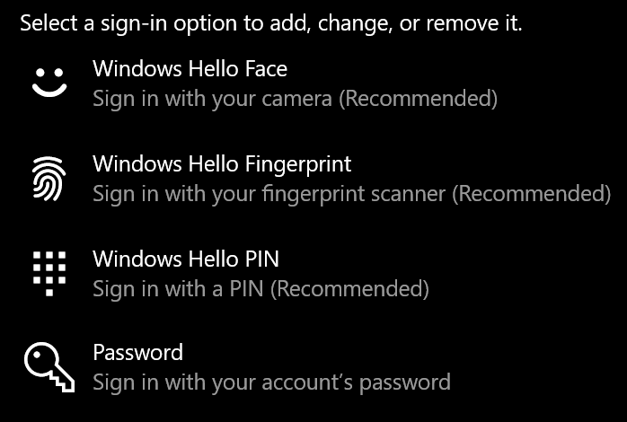

# Anmelden bei Windows 10 ohne Kennwort

Um zu vermeiden, dass Sie bei Windows Start ein Kennwort eingeben müssen, empfehlen wir, eine der Windows Hello sicheren Anmeldeoptionen wie PIN, Gesichtserkennung oder Fingerabdruck zu verwenden, falls verfügbar. Wenn Sie die sichere Anmeldung wirklich deaktivieren möchten, lesen Sie die Anweisungen unter "Automatische Anmeldung bei Windows 10".

**Sichern Windows Hello Alternativen zum Kontokennwort**

Wechseln Sie zu **Einstellungen > Konten > Anmeldeoptionen** (oder klicken Sie [hier](ms-settings:signinoptions?activationSource=GetHelp)). Verfügbare Anmeldeoptionen werden aufgelistet. Zum Beispiel: 

Klicken oder tippen Sie auf eine der Optionen, um sie zu konfigurieren. Wenn Sie Windows das nächste Mal starten oder entsperren, können Sie die neue Option anstelle eines Kennworts verwenden. 

**Automatische Anmeldung bei Windows 10**

**Hinweis**: Die automatische Anmeldung ist praktisch, führt jedoch zu einem Sicherheitsrisiko, insbesondere, wenn auf Ihren PC mehrere Personen zugegriffen werden kann. 

1. Klicken oder tippen Sie auf der Taskleiste auf die Schaltfläche " **Start** ".

2. Geben Sie **"netplwiz"** ein, und drücken Sie die EINGABETASTE, um das Fenster "Benutzerkonten" zu öffnen.

3. Klicken Sie in **Benutzerkonten** auf das Konto, bei dem Sie sich automatisch anmelden möchten, wenn Windows gestartet wird.

4. Deaktivieren Sie das Kontrollkästchen "Benutzer müssen einen Benutzernamen und ein Kennwort eingeben, um diesen Computer verwenden zu können".

    

5. Klicken Sie auf **OK**. Sie werden aufgefordert, das Kennwort für das von Ihnen ausgewählte Konto einzugeben und zu bestätigen. Klicken Sie zum Abschließen auf **OK**. Wenn Windows 10 das nächste Mal gestartet wird, wird automatisch das von Ihnen ausgewählte Konto angemeldet.
