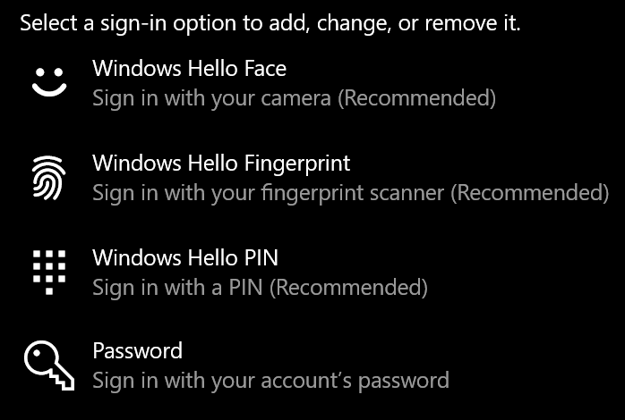
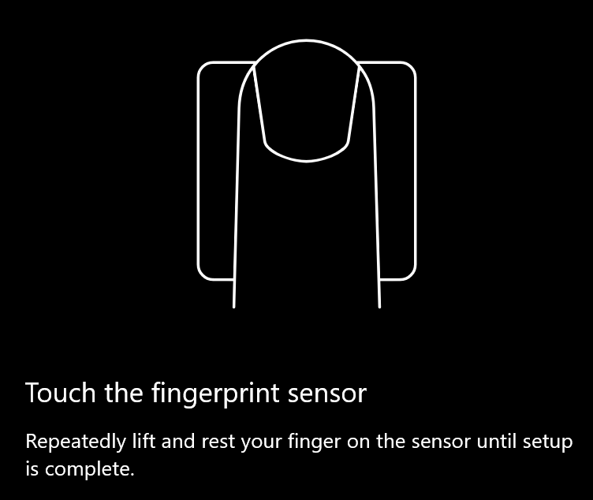
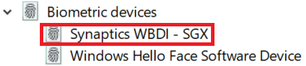

# Verwenden der Fingerabdruck-Entsperrungsoption in Windows 10

**Aktivieren Windows Hello Fingerabdrucks**

Um Windows 10 mit ihrem Fingerabdruck zu entsperren, müssen Sie Windows Hello Fingerabdruck einrichten, indem Sie mindestens einen Finger hinzufügen (damit Windows lernen können, sie zu erkennen). 

1. Wechseln Sie zu **Einstellungen > Konten > Anmeldeoptionen** (oder klicken Sie [hier](ms-settings:signinoptions?activationSource=GetHelp)). Verfügbare Anmeldeoptionen werden aufgelistet. Zum Beispiel: 

    

2. Klicken oder tippen Sie **auf Windows Hello Fingerabdruck**, und klicken Sie dann auf **"Einrichten**". Klicken Sie im Windows Hello Setupfenster auf **"Erste Schritte"**. Der Fingerabdrucksensor wird aktiviert, und Sie werden aufgefordert, Ihren Finger auf den Sensor zu platzieren:

   

3. Folgen Sie den Anweisungen, in denen Sie aufgefordert werden, wiederholt mit dem Finger zu scannen. Nach Abschluss dieses Vorgangs haben Sie die Möglichkeit, weitere Finger hinzuzufügen, die Sie für die Anmeldung verwenden möchten. Wenn Sie sich das nächste Mal bei Windows 10 anmelden, haben Sie die Möglichkeit, dazu Ihren Fingerabdruck zu verwenden.

**Windows Hello Fingerabdruck nicht als Anmeldeoption verfügbar**

Wenn Windows Hello Fingerabdruck in **den Anmeldeoptionen** nicht als Option angezeigt wird, bedeutet dies, dass Windows keinen Fingerabdruckleser/Scanner erkennt, der an Ihren PC angefügt ist, oder dass eine Systemrichtlinie die Verwendung verhindert (z. B. wenn Ihr PC von Ihrem Arbeitsplatz verwaltet wird). So beheben Sie Probleme: 

1. Wählen Sie die **Startschaltfläche** in der Taskleiste aus, und suchen Sie nach **dem Geräte-Manager**.

2. Klicken oder tippen Sie, um den **Geräte-Manager** zu öffnen.

3. Erweitern Sie im Geräte-Manager biometrische Geräte, indem Sie auf das zugehörige Chevron klicken.

   

4. Ihr Fingerabdruckscanner sollte als biometrisches Gerät, z. B. der Synaptics WBDI-Scanner, aufgeführt werden:

   

5. Wenn Ihr Fingerabdruckscanner nicht angezeigt wird und der Scanner in Ihren PC integriert ist, wechseln Sie zur Website des PC-Herstellers. Suchen Sie im Abschnitt "Technischer Support" für Ihr PC-Modell nach einem Windows 10 Treiber für einen Scanner, den Sie installieren können.

6. If the scanner is separate from the PC (attached via USB), go to the scanner manufacturer's website to find and install Windows 10 device driver software for the scanner model you have.
