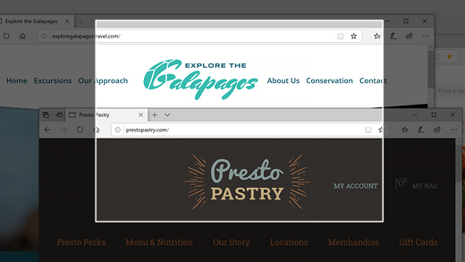
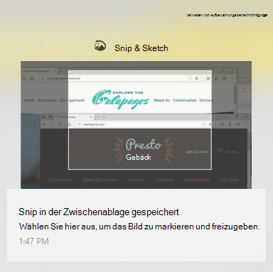

# Verwenden von Snip & Sketch zum Erfassen, Markieren und Freigeben von Bildern

Bildschirmskizze heißt jetzt **"Snip & Sketch**". **So nehmen Sie schnell eine Schnips:**

1. Drücken Sie die **Windows Logotaste + UMSCHALT+S**. Der Bildschirm wird abgedunkter und der Cursor als Kreuz angezeigt. 

2. Wählen Sie einen Punkt am Rand des Bereichs aus, den Sie kopieren möchten, und klicken Sie mit der linken Maustaste auf den Cursor. 

3. Bewegen Sie den Cursor, um den Bereich hervorzuheben, den Sie erfassen möchten. Der erfasste Bereich wird auf dem Bildschirm angezeigt.

   

Das Bild, das Sie abgeschnitten haben, wird in der Zwischenablage gespeichert und kann in eine E-Mail oder ein Dokument eingefügt werden. 

**Wenn Sie das Bild bearbeiten oder anzeigen möchten**: 

- Klicken Sie auf das Symbol "Benachrichtigungen" ganz rechts auf der Taskleiste. klicken Sie dann auf das soeben aufgenommene Bild. Die Schnips wird in der App "Snip & Sketch" geöffnet.

   
