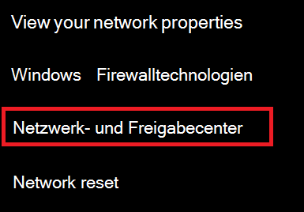
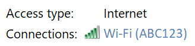
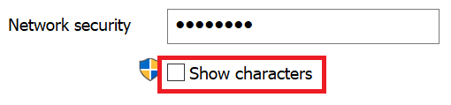

# Anzeigen Wi-Fi Netzwerkkennworts in Windows 10

1. Stellen Sie sicher, dass Ihr Windows 10-PC mit dem Wi-Fi Netzwerk verbunden ist.

2. Wechseln Sie zu **Einstellungen > Network & Internet > Status**, oder klicken oder tippen Sie [hier](ms-settings:network?activationSource=GetHelp), damit wir Sie jetzt dorthin bringen können.)

3. Klicken Sie auf **Netzwerk- und Freigabecenter**.

    

4. Im **Netzwerk- und Freigabecenter** wird neben **"Verbindungen**" der Name Ihres Drahtlosnetzwerks angezeigt. Wenn Ihr Netzwerk beispielsweise "ABC123" heißt, wird möglicherweise Folgendes angezeigt:

    

    Klicken Sie auf den Namen des Drahtlosnetzwerks, um das Fenster Wi-Fi Status zu öffnen. 

5. Klicken Sie im Fenster Wi-Fi Status auf **"Drahtloseigenschaften**", klicken Sie auf die Registerkarte " **Sicherheit** ", und aktivieren Sie " **Zeichen anzeigen"**.

    

